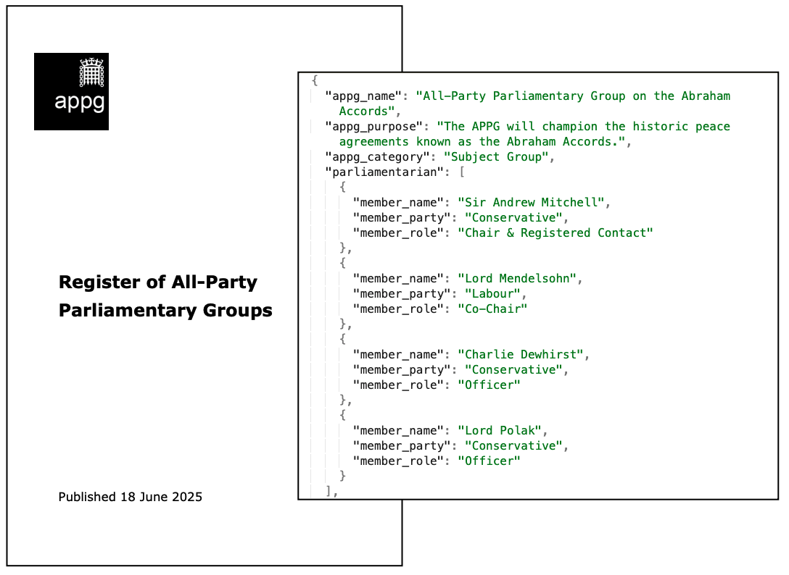

# Extracting APPG Information

APPG Extract pulls APPG information (name, Parliamentarians, registered benefits, etc) from their various webpages into a single nested list and JSON file for easy examination.

### About APPGs:

All-Party Parliamentary Groups (APPGs) are informal cross-party groups within Parliament (UK). APPGs exist to examine particular topics or causes such as small modular reactors, blood cancer, and Saudi Arabia. While APPGs can provide useful forums for bringing together stakeholders and advancing policy discussions, there have been instances of impropriety, and the groups have faced criticisms for potential conflicts of interest and undue influence from external bodies.

At at 18 June 2025, there were ~500 individual APPGs. Active APPGs are listed in Parliament's [Register of All-Party Parliamentary Groups](https://www.parliament.uk/mps-lords-and-offices/standards-and-financial-interests/parliamentary-commissioner-for-standards/registers-of-interests/register-of-all-party-party-parliamentary-groups/). The register is updated every ~6 weeks and contains information on the APPG's purpose, Parliamentarians, contact details, annual general meeting, and registrable benefits. The current Rules for APPGs were agreed by the House of Commons, on [19 July 2023](https://hansard.parliament.uk/commons/2023-07-19/debates/110BBCAB-684E-447C-9995-7DEA813D8D3F/All-PartyParliamentaryGroups). APPGs are overseen by the Parliamentary Commissioner for Standards and the Committee on Standards. 

### Getting APPG information:

Unlike much of Parliament's data, APPG information is not retrievable via an API. To obtain details on an APPG, users must navigate to the [Register of All-Party Parliamentary Groups](https://www.parliament.uk/mps-lords-and-offices/standards-and-financial-interests/parliamentary-commissioner-for-standards/registers-of-interests/register-of-all-party-party-parliamentary-groups/) (available as individual HTML webpages or a single PDF document).

### How it works:

Written in R, APPG Extract reads the HTML code for each APPG webpage into a single data frame. For each of the rows in this data frame (each corresponding to an APPG), it then extracts all information on the Group stored across several tables into a single nested list and JSON file.

The resulting list / JSON object contains 514 items (individual APPGs). Each item contains fields for the APPG's name, purpose, category, Parliamentarians (name, party, and role), contact details, annual general meeting information, and registered benefits.

The script currently operates on HTML files saved locally, but could easily be modified to incorporate web scraping.

### Main files:

| **File**            | **Description**                                                                         |
|---------------------|-----------------------------------------------------------------------------------------|
| appg_extract.Rmd    | Main file. Reads in HTML webpages and generates nested list of APPGs.                   |
| appg_extract.html   | HTML knit output of above.                                                              |
| appg_hyperlinks.txt | List of individual APPG webpages from 18 June 2025 APPG register.                       |
| all_appgs.RData     | Output file. Nested list of all APPGs and their details from the 18 June 2025 register. |
| all_appgs.json      | As above but in JSON format.                                                            |

### Et al.

TODO
